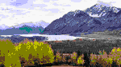
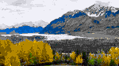
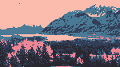
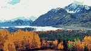
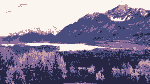

# RetroForge

> Convert modern images into authentic retro game assets — right in your browser.

RetroForge downscales images using hand-rolled algorithms, snaps every pixel to a retro color palette, and optionally applies Floyd-Steinberg dithering. No server uploads, no installs, no accounts required.

---

## Screenshots

| Sample 1 | Sample 2 | Sample 3 | Sample 4 | Sample 5 |
|:---:|:---:|:---:|:---:|:---:|
|  |  |  |  |  |

*All outputs processed directly in RetroForge — no post-editing.*

---

## Features

- **Custom downscaling** — two algorithms implemented from scratch:
  - *Nearest-neighbor* — hard pixel edges, classic retro look
  - *Box-filter* — area-average for smoother, more natural results
- **28 retro palettes** — PS1, GBA, SNES, NES, PICO-8, Game Boy, C64, CGA, EGA, ZX Spectrum, Atari 2600, and more
- **Floyd-Steinberg dithering** — error-diffusion for richer gradients within limited palettes
- **Drag & drop / paste** — drop a file, click to browse, or paste from clipboard
- **Side-by-side preview** — original and output displayed together at full resolution
- **Export PNG** — download the processed image at the downscaled resolution
- **Fully client-side** — all processing runs in the browser via the Canvas API; your images never leave your device

---

## Routes

| Path | Description |
| ---- | ----------- |
| `/` | Landing page |
| `/forge` | The image processing tool |

---

## Getting Started

### Prerequisites

- Node.js 18+
- npm, yarn, or pnpm

### Install & run

```bash
npm install
npm run dev
```

Open [http://localhost:3000](http://localhost:3000) for the landing page, or go directly to [http://localhost:3000/forge](http://localhost:3000/forge) for the tool.

### Build for production

```bash
npm run build
npm run start
```

### Lint & format

```bash
npm run lint      # Biome check
npm run format    # Biome format --write
```

---

## How It Works

### Processing pipeline

1. **Read** — source image pixels are read into a flat `Uint8ClampedArray` via an offscreen canvas
2. **Downscale** — custom nearest-neighbor or box-filter algorithm produces a smaller pixel array
3. **Quantize** — each pixel is mapped to the nearest palette color using Euclidean distance in RGB space
4. **Dither** *(optional)* — Floyd-Steinberg error diffusion spreads quantization error to neighboring pixels
5. **Render** — result is written to a canvas and displayed with `image-rendering: pixelated`

### Downscale algorithms

**Nearest-neighbor** maps each destination pixel to the single source pixel whose center is closest. Pure pixel-pick, no blending — gives the hard, crunchy look of classic retro hardware.

**Box-filter** computes the weighted average of all source pixels that overlap each destination pixel's footprint, with fractional coverage handled at the edges. Produces a softer, more natural result closer to what a real downsampler would output.

### Palette matching

Each pixel's RGB value is compared against every color in the selected palette using squared Euclidean distance in RGB space. The closest match wins. When dithering is enabled, the quantization error (difference between original and matched color) is distributed to the four neighboring pixels using the Floyd-Steinberg kernel:

```
        X   7/16
  3/16  5/16  1/16
```

---

## Project Structure

```
app/
  page.tsx              # Landing page (/)
  layout.tsx            # Root layout — fonts, global metadata
  globals.css           # Tailwind v4 base styles
  forge/
    page.tsx            # Tool page (/forge)
    layout.tsx          # Forge layout — scopes overflow:hidden

components/
  RetroForge.tsx        # Main tool shell — state, processing pipeline
  ControlPanel.tsx      # Left sidebar — palette, scale, method, dithering
  ImageCanvas.tsx       # Canvas renderer with pixelated display
  DropZone.tsx          # Image input — drag/drop, click, paste

lib/
  imageProcessor.ts     # Core algorithms — downscale, quantize, dither
  palettes.ts           # 28 palette definitions as RGB tuples
  utils.ts              # cn() helper (clsx + tailwind-merge)

public/
  sample-1.png          # Example RetroForge outputs
  sample-2.png
  sample-3.png
  sample-4.png
  sample-5.png
```

---

## Palettes

| ID | Name | Colors | Notes |
| -- | ---- | :----: | ----- |
| `ps1` | PS1 — 15-bit | ~100 | Representative PS1 color space |
| `gba` | GBA — 15-bit | ~60 | Greenish tint characteristic of GBA screen |
| `snes` | SNES — 15-bit | ~80 | Warmer, richer tone |
| `nes` | NES — 54 color | 54 | 2C02 PPU NTSC approximation |
| `gameboy` | Game Boy — 4 color | 4 | Classic 4-shade green |
| `gameboy-pocket` | Game Boy Pocket | 4 | 4-shade grayscale |
| `gameboy-color` | Game Boy Color | ~50 | Full GBC color range |
| `cga` | CGA — 16 color | 16 | Classic PC CGA palette |
| `ega` | EGA — 64 color | 64 | Full 6-bit PC EGA palette |
| `commodore64` | Commodore 64 | 16 | C64 VIC-II chip colors |
| `zx-spectrum` | ZX Spectrum | 15 | Normal + bright Spectrum colors |
| `apple2` | Apple II | 16 | Apple II composite video palette |
| `atari2600` | Atari 2600 NTSC | ~64 | TIA chip palette subset |
| `msx` | MSX — TMS9918 | 16 | TMS9918 video chip |
| `pico8` | PICO-8 | 16 | Fantasy console original palette |
| `pico8-extended` | PICO-8 Extended | 32 | Includes secret palette |
| `endesga-32` | ENDESGA 32 | 32 | Popular pixel art community palette |
| `endesga-64` | ENDESGA 64 | 64 | Extended ENDESGA palette |
| `sweetie-16` | Sweetie 16 | 16 | Soft, balanced pixel art palette |
| `resurrect-64` | Resurrect 64 | 64 | Rich, versatile pixel art palette |
| `apollo` | Apollo | 46 | Warm, painterly palette |
| `oil-6` | Oil 6 | 6 | Minimal 6-color palette |
| `twilight-5` | Twilight 5 | 5 | Minimal 5-color palette |
| `neon-nights` | Neon Nights | ~50 | Synthwave / cyberpunk |
| `arcade` | Arcade Cabinet | ~40 | Classic arcade RGB primaries |
| `dark-fantasy` | Dark Fantasy | ~80 | Moody, desaturated tones |
| `lospec-1bit` | 1-Bit Monochrome | 2 | Black & white |
| `lospec-2bit-grayscale` | 2-Bit Grayscale | 4 | 4-shade grayscale |

---

## Tech Stack

| Tool | Version | Purpose |
| ---- | ------- | ------- |
| [Next.js](https://nextjs.org) | 16 | App framework (App Router) |
| [React](https://react.dev) | 19 | UI |
| [Tailwind CSS](https://tailwindcss.com) | 4 | Styling |
| [Biome](https://biomejs.dev) | 2 | Lint & format |
| [lucide-react](https://lucide.dev) | 1.x | Icons |
| [clsx](https://github.com/lukeed/clsx) + [tailwind-merge](https://github.com/dcastil/tailwind-merge) | latest | Class name utilities |

---

## Contributing

1. Fork the repo
2. Create a feature branch: `git checkout -b feat/my-feature`
3. Make your changes and run `npm run lint`
4. Open a pull request

Adding a new palette? Just add an entry to `lib/palettes.ts` following the existing pattern — the UI picks it up automatically.

---

## License

MIT — do whatever you want with it.
